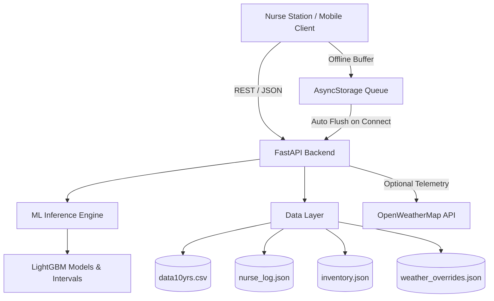

# 🏥 SmartCare — Primary Healthcare Intelligence & Forecasting Platform

**SmartCare** is an AI-assisted clinical decision support, patient volume forecasting, epidemic surveillance, and inventory management platform designed for Primary Health Centers (PHCs) and rural clinics.

It bridges machine learning models with front-line nursing workflows, enabling healthcare staff to log daily symptoms, track medicine consumption, receive automated stockout warnings, and anticipate incoming patient surges based on historical clinic records and meteorological telemetry.

---

## 📑 Table of Contents

- [Key Capabilities](#-key-capabilities)
- [System Architecture](#-system-architecture)
- [Repository Structure](#-repository-structure)
- [Machine Learning Pipeline (Leak-Free)](#-machine-learning-pipeline-leak-free)
- [API Reference](#-api-reference)
- [Mobile Application (Expo / React Native)](#-mobile-application-expo--react-native)
- [Getting Started](#-getting-started)
  - [Prerequisites](#prerequisites)
  - [Backend Setup (FastAPI)](#backend-setup-fastapi)
  - [Model Training](#model-training)
  - [Running the Test Suite](#running-the-test-suite)
  - [Mobile App Setup (Expo)](#mobile-app-setup-expo)
  - [Environment Variables](#environment-variables)
- [Flaws Corrected in this Release](#-flaws-corrected-in-this-release)
- [License](#-license)

---

## 🌟 Key Capabilities

1. **Daily Patient Volume Forecasting**:
   - Predicts incoming clinic visits using strictly historical temporal lags ($t-1, t-7, t-14, t-28$), 7/14/28-day rolling statistics, calendar signals (`dow`, `month`, `is_weekend`), and weather telemetry (`temperature`, `rainfall`, `humidity`).
   - Computes dynamic status thresholds (`GREEN`, `YELLOW`, `RED`) based on 90-day clinic visit percentiles.
   - Calculates 10th-to-90th percentile prediction intervals (`p10`, `p90`).

2. **Pharmaceutical Demand Prediction**:
   - Multi-item inventory demand predictions (`paracetamol`, `ors_packets`, `malaria_kits`, `antibiotics`).
   - Forecasts weekly peak consumption against existing stock levels to preempt stockouts.
   - Calculates real-time **days-to-stockout** metrics.

3. **Syndromic Outbreak Surveillance**:
   - Multi-label LightGBM classifiers predicting probabilities for 6 key clinical presentations: `fever`, `cough`, `diarrhea`, `vomiting`, `skin_rash`, `animal_bite`.
   - Continuous 7-day surge vs. baseline cluster detection alerting staff to emerging epidemics.

4. **Frontline Nurse Station Triage**:
   - Fast, tactile stepper interface for nurses to record daily case counts and qualitative observations.
   - 7-day visual calendar strip with past-day inspection.

5. **Robust Offline Support**:
   - Local queuing engine (`AsyncStorage`) that buffers triage logs and inventory edits during network dropouts and automatically syncs upon reconnection.

---

## 🏗️ System Architecture



---

## 📂 Repository Structure

```
SmartCare/
├── api/
│   ├── main.py                  # FastAPI application & REST endpoints
│   ├── services/
│   │   ├── demand.py            # Inventory demand inference service
│   │   └── syndromes.py         # Syndrome probability inference service
│   └── tests/                   # API test suite
├── data/
│   └── raw/
│       ├── data10yrs.csv        # 10-year historical PHC dataset
│       ├── inventory.json       # Live inventory store
│       ├── nurse_log.json       # Nurse triage logs
│       └── weather_overrides.json # Weather telemetry overrides
├── ml/
│   ├── artifacts/               # Trained models, feature configs, intervals
│   ├── train_volume.py          # LightGBM volume training script
│   ├── train_demand.py          # Multi-item demand training script
│   ├── train_syndromes.py       # Multi-label syndrome training script
│   └── utils.py                 # Feature engineering & lag calculation utilities
├── smartcare-mobile/
│   ├── App.tsx                  # Root navigation & tab bar
│   ├── src/
│   │   ├── api.ts               # Typed API client & data schemas
│   │   ├── constants.ts         # Design tokens & storage helpers
│   │   ├── offlineQueue.ts      # Offline persistence & auto-sync
│   │   ├── types.ts             # Domain type definitions
│   │   ├── ui.tsx               # Design system component library
│   │   └── pages/
│   │       ├── Home.tsx         # Volume forecast, outbreak monitor, triage logger
│   │       ├── Alerts.tsx       # Stockout risks & outbreak surveillance
│   │       ├── Inventory.tsx    # Stock management, days-to-stockout steppers
│   │       ├── Login.tsx        # Nurse station sign-in & endpoint configuration
│   │       └── Settings.tsx     # Server config, weather telemetry, cache management
│   └── package.json
├── tests/
│   ├── conftest.py              # Pytest fixtures & environment setup
│   ├── test_api.py              # FastAPI endpoint integration tests
│   ├── test_etl.py              # Data preprocessing & feature engineering tests
│   └── test_ml.py               # Model loading & inference validation tests
├── requirements.txt             # Python dependencies
└── README.md                    # Project documentation
```

---

## 🔬 Machine Learning Pipeline (Leak-Free)

The models strictly prevent data leakage by using only past time-series observations:

| Feature Category | Features Included |
|---|---|
| **Lags** | $t-1, t-7, t-14, t-28$ |
| **Rolling Stats** | 7-day, 14-day, 28-day rolling mean and standard deviation (shifted by 1) |
| **Calendar** | Day of week (`dow`), month, weekend indicator (`is_weekend`) |
| **Meteorological** | Temperature (°C), Rainfall (mm), Humidity (%) |
| **Syndromic Signals** | Historical case counts from nurse logs |

---

## 🔌 API Reference

### Core Endpoints

| Method | Endpoint | Description |
|---|---|---|
| `GET` | `/` | Health check & service discovery |
| `GET` | `/mobile/today` | Consolidated dashboard payload (volume, confidence intervals, syndromes, alerts) |
| `GET` | `/stats/summary` | 7-day & 30-day analytics, day-of-week averages, volume trends |
| `POST` | `/predict/volume` | LightGBM patient volume prediction |
| `POST` | `/predict/demand` | Multi-item pharmaceutical demand forecast |
| `POST` | `/predict/syndromes` | Syndromic probability distribution |
| `GET` | `/alerts` | Active stockout and reorder warnings |
| `GET` | `/alerts/outbreak` | Syndromic outbreak surge and cluster detection |
| `GET` | `/inventory/enriched` | Real-time stock levels with calculated days-to-stockout |
| `POST` | `/inventory/upsert` | Update medicine on-hand count or reorder point |
| `POST` | `/nurse/log` | Record daily triage symptom observations |
| `GET` | `/nurse/log/history` | Historical nurse triage logs (supports `?days=N`) |
| `POST` | `/weather/fetch` | Fetch live OpenWeather telemetry for station coordinates |
| `POST` | `/weather/upsert` | Manual override of daily climate parameters |

---

## 🚀 Getting Started

### Prerequisites

- **Python**: 3.10 to 3.13
- **Node.js**: 18+ & npm
- **Expo CLI**: Installed globally or via `npx`

---

### Backend Setup (FastAPI)

1. **Clone the repository**:
   ```bash
   git clone https://github.com/Balaji-1206/SmartCare.git
   cd SmartCare
   ```

2. **Create and activate a virtual environment**:
   ```bash
   # Windows (PowerShell)
   python -m venv .venv
   .\.venv\Scripts\Activate.ps1

   # macOS / Linux
   python3 -m venv .venv
   source .venv/bin/activate
   ```

3. **Install dependencies**:
   ```bash
   pip install -r requirements.txt
   ```

4. **Start the FastAPI server**:
   ```bash
   uvicorn api.main:app --host 127.0.0.1 --port 8000 --reload
   ```

5. **Access OpenAPI Docs**:
   Navigate to [http://127.0.0.1:8000/docs](http://127.0.0.1:8000/docs) in your browser.

---

### Model Training

To retrain all LightGBM models with the latest historical data:

```bash
# 1. Train volume forecasting model
python ml/train_volume.py

# 2. Train pharmaceutical demand models
python ml/train_demand.py

# 3. Train syndrome probability models
python ml/train_syndromes.py
```

---

### Running the Test Suite

```bash
pytest tests/ -v
```

---

### Mobile App Setup (Expo)

1. **Navigate to the mobile directory**:
   ```bash
   cd smartcare-mobile
   ```

2. **Install JavaScript dependencies**:
   ```bash
   npm install
   ```

3. **Start Expo development server**:
   ```bash
   npx expo start
   ```

4. **Run on Device or Emulator**:
   - Press `w` for Web Browser (`http://localhost:8081`).
   - Press `a` for Android Emulator.
   - Press `i` for iOS Simulator.
   - Scan the QR code with **Expo Go** on your physical mobile phone.

---

### Environment Variables

Create a `.env` file in the project root:
```ini
OPENWEATHER_API_KEY=your_openweathermap_api_key_here
```

---

## ✅ Flaws Corrected in this Release

1. **Eliminated Target Leakage**:
   - Removed same-day demographic patient counts (`male_patients + female_patients = total_patients`) from the volume forecasting feature set.
   - Removed `"y_count"` (ground-truth label) from the syndrome classifier feature sets.
2. **Dynamic Time-Series & Nurse Log Integration**:
   - Predictions now dynamically combine historical CSV data with any logged nurse entries and weather overrides.
3. **In-Memory Caching & Performance**:
   - Base CSV is cached in-memory on startup instead of parsing 3,654 rows on every single request.
4. **Thread-Safe File Persistence**:
   - Added thread locking around JSON file read/write operations to prevent race conditions.
5. **Mobile Offline Sync Queue Integration**:
   - Connected `offlineQueue.ts` to `Home.tsx`, `Inventory.tsx`, and `Settings.tsx` with automatic and manual sync capabilities.
6. **Mobile Auth State Persistence**:
   - Enabled `isAuthed()` check in `smartcare-mobile/App.tsx` so users remain logged in across app reloads.
7. **Populated Missing Files & Stubs**:
   - Created `ml/utils.py`, `ml/train_volume.py`, `ml/train_demand.py`, `ml/train_syndromes.py`.
   - Populated `smartcare-mobile/src/types.ts`.
   - Created full test suite in `tests/test_api.py`, `tests/test_ml.py`, `tests/test_etl.py`, `tests/conftest.py`.

---

## 📄 License

This project is open-source and available under the [MIT License](LICENSE).
